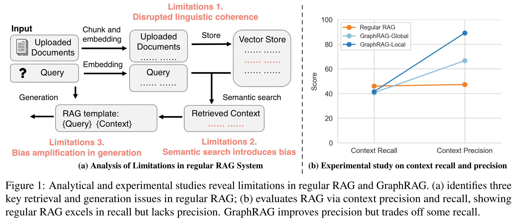
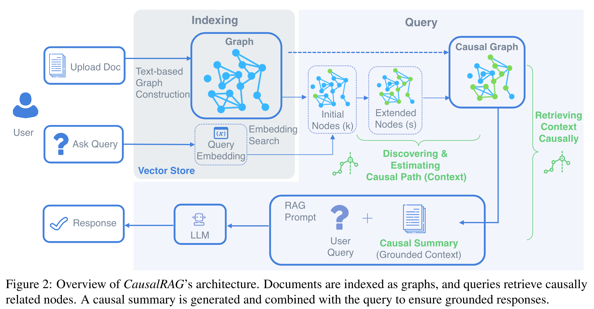

<h1 align="center">CausalRAG</h1>
<p align="center">
  <em>CausalRAG: Integrating Causal Graphs into Retrieval-Augmented Generation</em>
</p>
<p align="center">
  <a href="https://arxiv.org/abs/2503.19878">
    
  </a>
  <a href="LICENSE">
    
  </a>
  <a href="#">
    
  </a>
</p>


---

## :sunny: Quick Intro: Why CausalRAG? 



Retrieval-Augmented Generation has three chronic flaws:  
1. **Chunking breaks context** and coherence.  
2. **Semantic similarity ≠ causal relevance**.  
3. **Noise compounds** during generation.

CausalRAG remedies this by **explicitly modeling cause–effect links** in the retrieved evidence, preserving context and filtering irrelevant chunks.

---

## :house: CausalRAG Architecture 



1. **Indexing** – Build a text-based graph for every document.  
2. **Causal Path Discovery** – Select *k* seed nodes, expand *s* hops, and let an LLM infer causal chains.  
3. **Causal Summary** – Trace the strongest paths, compress them, and feed the summary into the generator.  
4. **Generation** – Produce answers grounded in causality, not mere correlation.

---

## Quick Start ⚠️ *Work in progress*  

> **Work in progress** – scripts and datasets will be uploaded shortly.

```bash
# 1) Clone & create a venv

# 2) Install

# 3) Set your OpenAI key
export OPENAI_API_KEY="sk-..."

# 4) Run the demo

```

---

## 📚 Citation 

Thank you for your interest in CausalRAG.

If you find our work helpful, please cite:

```bibtex
@misc{wang2025causalragintegratingcausalgraphs,
      title={CausalRAG: Integrating Causal Graphs into Retrieval-Augmented Generation}, 
      author={Nengbo Wang and Xiaotian Han and Jagdip Singh and Jing Ma and Vipin Chaudhary},
      year={2025},
      eprint={2503.19878},
      archivePrefix={arXiv},
      primaryClass={cs.CL},
      url={https://arxiv.org/abs/2503.19878}, 
}
```


---

## 🤝 Contributing 

Pull requests are welcome! Please open an issue to discuss major changes.

Make sure to run `make test && make style` before submitting.

1. **Fork** → 2. **Create feature branch** → 3. **Commit** → 4. **Open PR**

---

## 📝 License & Acknowledgements 

- Code released under the MIT License – see [`LICENSE`](LICENSE).  
- Built with 🤗 Transformers, PyTorch, and NetworkX.

---

<div align="center">
  <sub>Made with ❤ by <a href="https://github.com/Pwnb">Pwnb</a> and collaborators.</sub>
</div>
