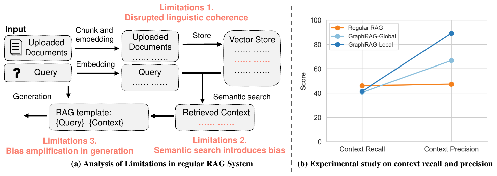
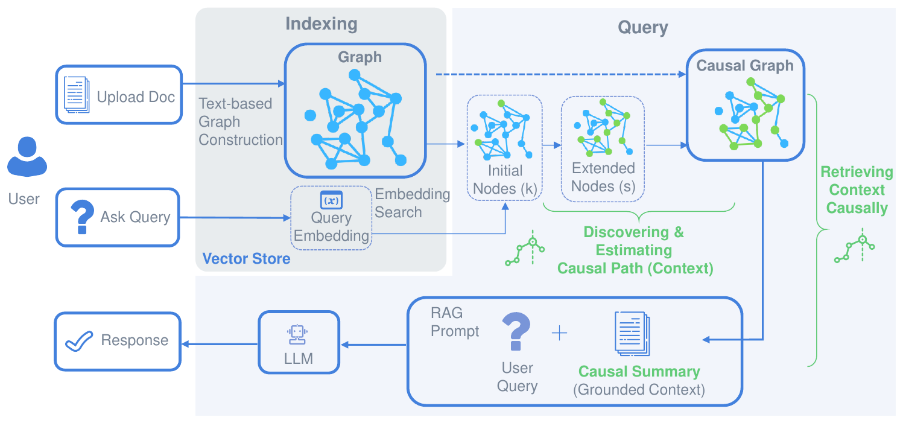

<h1 align="center">CausalRAG</h1>

<p align="center">
  <b>Integrating Causal Graphs into Retrieval-Augmented Generation</b><br>
  Findings of ACL 2025
</p>

<p align="center">
  
  
</p>

## Why CausalRAG

Traditional RAG retrieves context by **semantic similarity, not causal
relevance**, so it pulls in superficially related but logically irrelevant
passages and can produce shallow or unfaithful answers. CausalRAG addresses this:

- 🧩 **Causal-path reasoning.** It builds a text graph, traces the **causal paths**
  connecting query-relevant nodes, summarizes them into a causal report, and
  conditions generation on that report, improving faithfulness without
  sacrificing recall.
- ⚖️ **Balances recall and precision.** Causal grounding keeps relevant context
  while filtering causally-irrelevant noise.

#### The regular RAG and Graph-based RAGs trade-off

Regular RAG retrieves whatever is semantically closest, which favors recall but
lets in noise and breaks the logical thread between passages. Graph-based RAG
structures and ranks the knowledge first, which sharpens precision but tends to
drop less central yet still relevant context, trading away recall. CausalRAG
aims to keep both by retrieving along causal paths rather than surface
similarity.

<p align="center">
  
</p>
<p align="center"><em>Regular RAG retrieves by semantic similarity, which disrupts coherence and injects bias; graph-based RAG raises precision but trades off recall.</em></p>

## How CausalRAG works

<p align="center">
  
</p>
<p align="center"><em>Documents are indexed as a graph; a query retrieves a connected causal subgraph, which is summarized and used to generate a grounded answer.</em></p>

At indexing time, an LLM parses each document into a graph of entities and the
relationships between them. At query time, CausalRAG locates the graph nodes most
relevant to the question and walks outward along their edges to gather the
connected causal subgraph, that is, the causal paths surrounding the query. An
LLM then turns that subgraph into a concise causal analysis, and a final
generation step uses it to produce an answer grounded in those causal paths
rather than in loosely related text.

See [docs/method.md](docs/method.md) and
[docs/graph_construction.md](docs/graph_construction.md) for details.

## Installation

```bash
git clone https://github.com/Pwnb/CausalRAG.git
cd CausalRAG
python -m venv .venv && source .venv/bin/activate

pip install -e .

cp .env.example .env        # then add your OPENAI_API_KEY
```

## Quickstart: text → causal graph → QA

`build_graph` constructs the text graph; `query_causal_rag` retrieves a focused
subgraph, summarizes the **causal paths**, and answers.

```python
from causalrag import build_graph, query_causal_rag

text = """
Sleep deprivation raises the stress hormone cortisol. Elevated cortisol
increases blood pressure and promotes inflammation, which damages blood
vessels and accelerates arterial plaque buildup.
"""

graph_path = build_graph(text, out_path="runs/demo/graph.json")
result = query_causal_rag(str(graph_path), "How can poor sleep harm the heart?")
print(result["answer"])
```

Run the bundled example with `python examples/quickstart.py`, or build from your
own corpus (`.txt`, `.pdf`, or raw text).

## Repository layout

```
causalrag/
  graph.py        indexing: text -> entity/relation graph
  retrieval.py    locate relevant nodes and expand the causal subgraph
  method.py       query_causal_rag: causal report + grounded answer
  prompts.py      causal-discovery / causal-summary prompts
  llm.py          OpenAI chat wrapper (reads OPENAI_API_KEY)
examples/quickstart.py
tests/test_pipeline.py
docs/
```

## Citation

```bibtex
@inproceedings{wang2025causalrag,
  title     = {CausalRAG: Integrating Causal Graphs into Retrieval-Augmented Generation},
  author    = {Wang, Nengbo and Han, Xiaotian and Singh, Jagdip and Ma, Jing and Chaudhary, Vipin},
  booktitle = {Findings of the Association for Computational Linguistics: ACL 2025},
  pages     = {22680--22693},
  year      = {2025},
  url       = {https://github.com/Pwnb/CausalRAG}
}
```

See also the successor, **CausalRAG2**
([github.com/Pwnb/CausalRAG2](https://github.com/Pwnb/CausalRAG2), ICML 2026),
which extends this with a community/topic hierarchy and explicit **causal gates**
across modules, plus the **HolisQA benchmark**.

## License

Released under the [MIT License](LICENSE).
